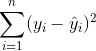
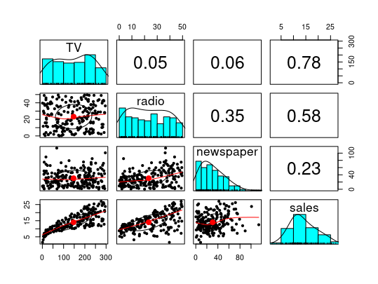

## Linear regression 线性回归

* Topics:
  * Logistics and Recap
  * Random variable and distributions(continued)
  * Ordinary Linear Regression 普通线性回归

### QUESTIONS
  * what is the differences between data mining and machine learning
    * 在数据挖掘中，我们可以对参数解释，在机器学习中参数众多，我们无法准确对参数做解释。
    * 在机器学习中，我们处理的对象过程中有一个学习的过程，比如如何在已经识别猫狗的前提下，进一步识别猫站在狗身上。

### tips
  * sample with replacement 不放回抽样
  * sample without replacement 放回抽样

### 线性回归
* 理论部分
  * 一种达到变量间关系的统计学过程
    * 响应变量(因变量,Y)
    * 预测变量(自变量,X)
  * 广泛应用于预测
  * 我们将研究最小二乘估计技术的方法 least squares estimation technique
  * 最简单的线性回归公式:
    * $\beta_0$和$\beta_1$也同样被称作模型系数、参数、权重。
    * 我们使用数据集获取$\beta_0$和$\beta_1$来对新的X值做预测。
  * 因为$\beta_0$和$\beta_1$是预估值，所以在获取新的$y_i$值时会有偏差。
    * 这些错误值(我们希望小)被叫做残余/剩余 ε。
      * 公式为:
      * $\hat\beta_0$和$\hat\beta_1$这些值被选作最小化剩余值的和(RSS,剩余值的平方和):
      * 换言之我们设置了以下优化公式:
    * 同样的$\hat\beta_0$和$\hat\beta_1$可以计算通过RSS公式:
    * 一旦我们有了$\hat\beta_0$和$\hat\beta_1$，对于X值的预测值可以通过下面公式获取:
    * 事实上，ε的值出现在所有出现偏差值的模型中:
  * 几何学解释 Geometric interpretation
    * 
    * 
    * 
      * 最好的回归线是哪个？
        * 平方和最小的
  * 当只有一个变量的时候线性回归的公式为:Y = β0 + β1X + ε
  * 当存在多个变量的时候线性回归的公式可以通用化为:Y = β0 + β1X1 + β2X2 + … + βnXn + ε
  * 例子:200*4的广告数据 
    * 销售额是预测值
    * tv、radio、newspaper是变量
    * 在R中使用公式:lm(sales ~ radio, data = df)
      * 这里代表含义是sales的值依赖于radio
      * 如果需要加上额外变量sales ~ radio + TV
      * 如果变量非常多，可以表示为:sales ~ .
      * 如果参与预测的变量集中不包含某个变量:sales ~ -TV 表示预测变量中不包含TV
    * 让我们可以通过广播广告与销售额的影响通过线性回归
      * 
      * 得到的线性回归方程为: sales = β0 + β1\*radio = 9.312 + 0.203*radio
        * 如果在radio上投入1000，销售额会得到212
        * 如果β0是负数，对应销售额会如何？取决于模型建立的场景，在这个场景中即使β0是负数也就是Intercept是负数，即使对radio上不投入，对应的销售额也不应该会是负数。
      * 在R中代码如下:
        * plot(df\$radio, df$sales)
        * abline(model.radio)
        * 
    * 让我们通过全部广告渠道与销售额的影响通过线性回归
      * 
      * 图中的t value给出了每个变量独立所占的权重，更多的是要关注那些接近0的变量，代表着所占权重极低，这并不是说t value越大，就一定所占权重越大，还需要看其余属性。
      * 得到的线性回归方程为: sales = β0 + β1\*TV + β2 * radio + β3 * newspaper = 2.939 + 0.046 * TV + 0.189 * radio – 0.001 * newspaper
      * 我们建立数据模型，我们希望这个模型中的variance方差越大越好
      * 通过R方程给出的结果有几个关键词(方差的一种表现形式):
        * Multiple R-squared:多变量方差在总方差总的比例，加入的变量越多值越大(排除不好的变量)，接近1代表模型越好
        * Adjusted R-squared:在完成n个变量加入计算后，再加入剩余变量会导致r-squared值降低，至此停止得到的值
        * F-statistic:
* 假设检验 Hypothesis testing
  * 是用来判断样本与样本、样本与总体的差异是由抽样误差引起还是本质差别造成的统计推断方法。显著性检验是假设检验中最常用的一种方法，也是一种最基本的统计推断形式，其基本原理是先对总体的特征做出某种假设，然后通过抽样研究的统计推理，对此假设应该被拒绝还是接受做出推断。常用的假设检验方法有Z检验、t检验、卡方检验、F检验等。
  * p-values，统计显著性(α)，假设检验
    * $H_0$代表无效假设 vs $H_1$代表假设
    * $\alpha$：P(非$H_0$除以$H_0$是真) 我们希望这个值足够小 5%这种
    * p-value:P(极端的值除以$H_0$是真)
  * 假设检验
    * p-value$<=$$\alpha$:结果并非无效，结果统计显著
    * p-value$>$$\alpha$:结果无效
* 分析
  * 为了理解我们的回归模型效果如何，我们需要提出几个问题
    * 是否至少有一个预测变量可用于预测结果？
    * 所有的预测变量都有用于预测结果，还是部分预测变量也用于预测结果？
    * 模型与数据的拟合程度如何？
    * 通过预测值，对应的实际结果与预测结果之间准确吗？
  * 是否至少有一个预测变量可用于预测结果？
    * $H_0$=$\beta_1$=$\beta_2$=$\beta_3$=...=$\beta_n$=0
    * $H_1$=至少有一个$\beta$是非0的
    * 为了回答$H_0$和$H_1$的问题，我们定义F-statistic:
      * 
      * RSS:Residual Sum of Squares 残差平方和 
        * 其中$y_i$被解释变量Y的观测值 也就是真实值，$\hat{y_i}$被解释变量Y的估计值
      * TSS:Total Sum of Squares 总离差平方和/总平方和 
        * 其中$\overline{y}$被解释变量的平均值，$y_i$被解释变量Y的观测值 也就是真实值
      * 如果变量和结果没有联系，那么F-statistic接近1，$H_0$成立；如果F-statistic大于1，$H_1$成立。
      * 如果p-value与F-statistic值非常小，给了我们很强的证据证明变量中有与结果值具备很强关系。
  * 所有的预测变量都有用于预测结果，还是部分预测变量也用于预测结果？
    * 同上，我们通过假设校验来观察p-value在不同变量的预测结果
      * 
      * 我们通过p-values看出tv和radio显示与销售额的关系很大，p-values的值很小
      * 报纸显示与销售额的关系不大，因此$H_0$假设成立
      * 
      * 这张图显示几个变量之间的相关性
        * tv和sales之间的相关性最高，同时也能看出newspaper与sales之间的相关性较低
        * 同时也发现radio与newspaper具备较强的相关性
    * 通常，我们要做的是特征选择，这是一个难题
      * 假设有p个预测因子，我们会有$2^p$个模型。
      * 在机器学习中可能有成千上万个预测因子，我们无法准确的说出每个因子代表什么含义，但是我们知道这个模型是如何运作的
      * 是人为确定因子还是交由机器确定因子的重要性，这很难回答
      * 策略：
        * 前向选择:从无预测因子模型中加因子
        * 后向选择:从全预测因子模型中减去p-values值最大的因子
  * 模型与数据的拟合程度如何？
    * 通过以下统计概念
      * RSE:Relative Squared Error相对平方误差 越接近0越好
        * 
      * RMSE:Root Mean Squared Error均方根误差
        * 
      * $R^2$:描述了回归模型所解释的因变量方差在总方差中的比例 越接近1证明模型越好
        * 
        * 
    * 残差分析residual analysis是另一种方式来看模型与数据的拟合程度 需要养成习惯，每个回归模型都做残差分析
      * 残差应该是同方差的(残值的方差不能与拟合值相差太高或太低)
      * 在拟合值范围以0为区间
      * 残差应该是正态分布
      * 残差之间应该无关联性
      * 好的残差图表:
      * 坏的残差图表:
        * 这个图表中我们可以对范围内值做准确判断
      * 从广告数据中残差图什么样的？
        * 
        * 
        * 
          * 从图中看值确实在0附近，但是看上去并不是正态分布的
          * 有凸的形状，暗示着数据中可能存在非线性因素
  * 通过预测值，对应的实际结果与预测结果之间准确吗？
    * 线性回归的模型近似于真实数据
      * 
    * 近似关系会产生部分错误
    * 为了解释错误值，我们计算置信值来确定真实值与预测值差距
      * 显著性水平Significance level(α):假设$H_0$为真，错误概率
      * 置信区间Confidence interval:参数的真实值有一定概率落在测量结果的周围的程度
      * 置信水平Confidence level:构造总体参数的多个样本区间中，包含总体参数的区间占总数之比，一般用1-α表示
      * 预测区间Prediction interval:R中用predict.lm()，会比置信区间会大一点
        * 置信水平越大，往往置信区间也会随之变大
        * 95% +-6; 99% +-10
        * 
        * 可以设置置信水平 
  * 影响回归的因素
    * Multi-collinearity多重共线性
      * 在做模型分析时需要对模型做假设校验，此时需要将不相干的变量变成常数，如果变量本身间存在相关性，那就无法转为有效的常数
* 补充
  * 回归中目前处理的都属数字类型的字段内容，也可以处理诸如颜色这样属性
  * 多元回归 multidominal regression
  * R语言基础功能多了解
  * dplyr包介绍