##  Components of Learning, Decision Trees 学习组成部分和决策树

* Topics:
  * Logistics and Recap
  * Follow instructions!
    * Decimal places
    * Read the questions
  * The dplyr package
  * Components of learning
  * Decision trees

### 组成部分
* 回想一下大多数的数据挖掘/机器学习算法是在矩阵中运行的
* 规范的样式是这样的: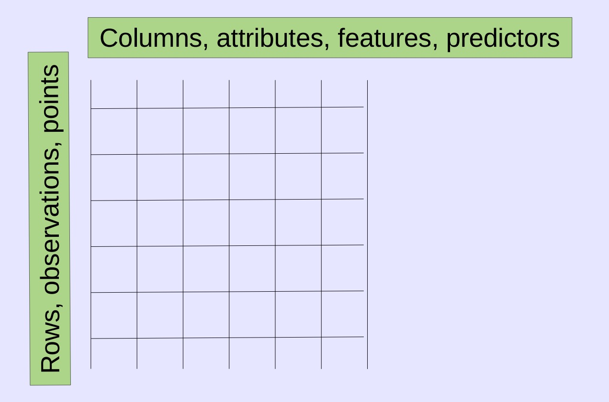
* 文档数据布局示例: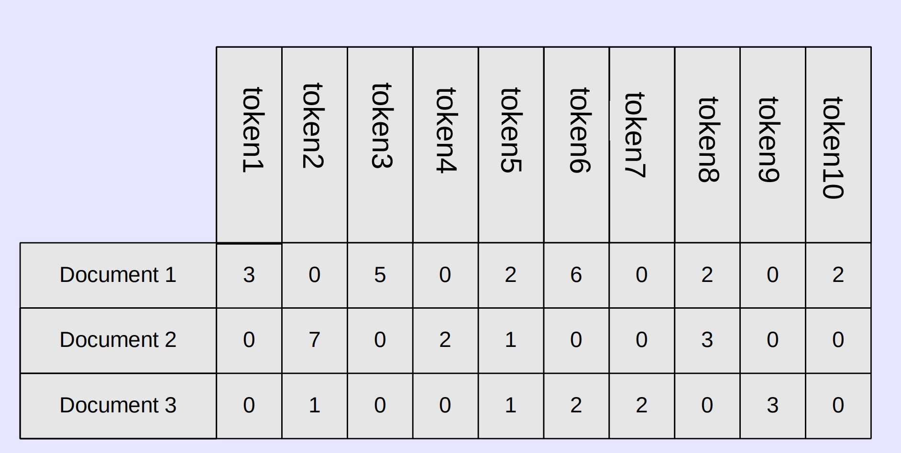
* 图数据布局示例: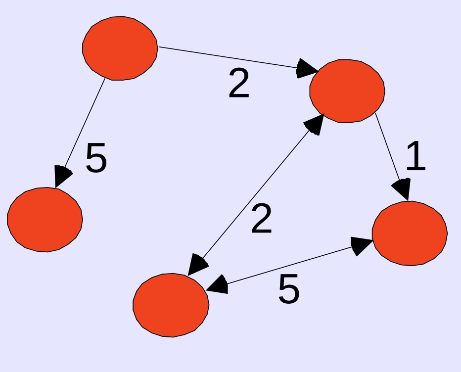
  * 结果证明，图可以展示为矩阵
* 公式表达
  * 输入:X,一个大于1个维度的矩阵
  * 输出:y,因变量
  * 目标函数:f:X->Y
  * 数据:($x_1,y_1$),($x_2,y_2$)...($x_n,y_n$)
  * 假设:g:X->Y
  * 期望:g$\approx$f
* 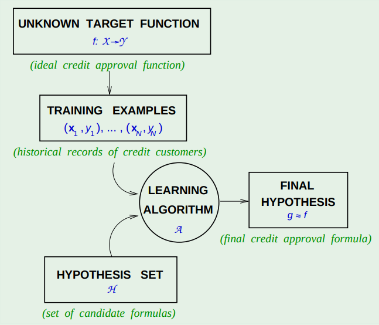
* 术语:学习器，分类器，模型
  * 学习器，通过x y的输入生成分类器
  * 分类器，通过上者的输入生成新y
  * 模型，由学习器生成，分类器通过模型来预测
* 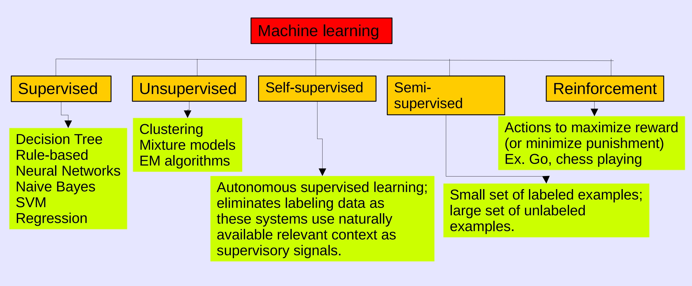
* 数据科学家的时间分配 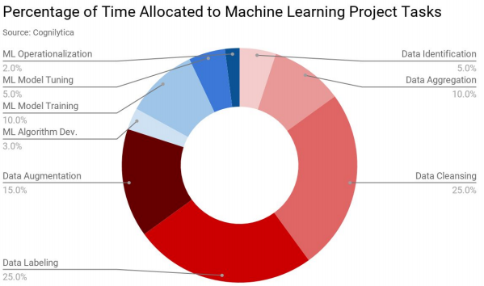
* 工作流 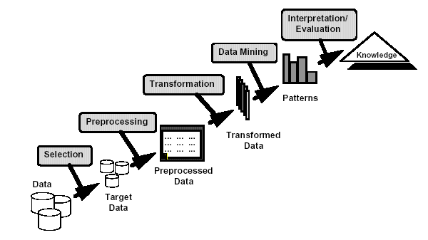
* R中有以下几种数据类型
  * Numeric 浮点数
  * Integer 整形
  * Factor 因子
    * 带序号因子 {“small”, “medium”, “large”}
    * 名词  {“blue”, “green”, “red”}
  * 字符串
* 特定算法需要特定的数据类型
* 在数据转化的时候需要确保后续的算法处理需要的数据类型可以对应上

### 决策树
* 理论部分
  * 我们的首个分类算法
  * 分类:目标是学习目标函数g，将每个属性集X映射到一个预定义的类标签Y
    * 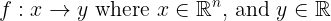
  * 例子
    * 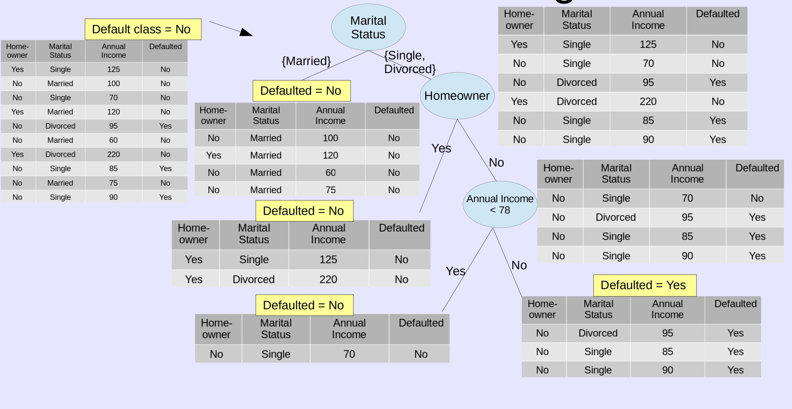
    * 默认分组;按照婚姻状态分组
      * 婚姻状态按照已婚/未婚+离婚
      * 是否有房屋
      * 收入分类
  * Hunt’s algorithm 亨特算法
    * 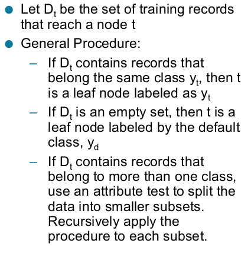
  * 现在我们知道如何构建一个决策树，首先需要做到如何拆分数据
  * 贪心策略
    * 基于属性测试优化结果来拆分数据
  * 问题：
    * 如何拆分数据
      * 特定属性拆分
        * 取决于属性类型
          * 二元属性
          * 类别属性(不存在排序)
          * 类别属性(存在排序)
          * 连续值
            * 先排序
            * 将数据拆分n-1块，按区间分类 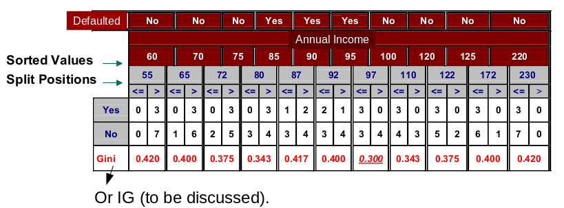
        * 取决于分裂个数
          * 二元
          * 多元
      * 如何确定最优拆分
        * 熵:涉及的不确定性数量随机变量的值，或系统中的无序.
        * 熵值的公式定义: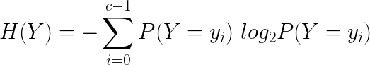
        * 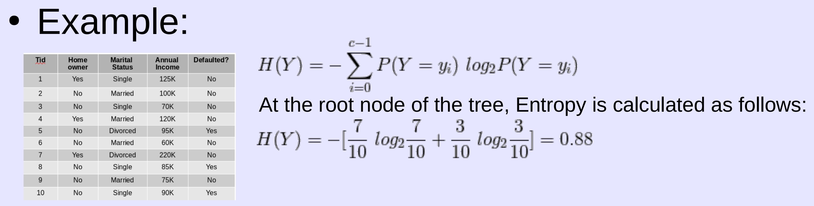
        * 在决策树算法中，熵值衡量纯度.
          * 纯度定义为节点内属于特定类的观察的分数
            * 如果观察值都属于同一类，我们有了纯净的结点，当我们有纯净的结点，我们就完成了最小化熵.
          * 衡量节点纯净度方法:
            * Gini index (使用CART和rpart包)
            * 熵(并不是概率问题)
            * 误分类错误
            * 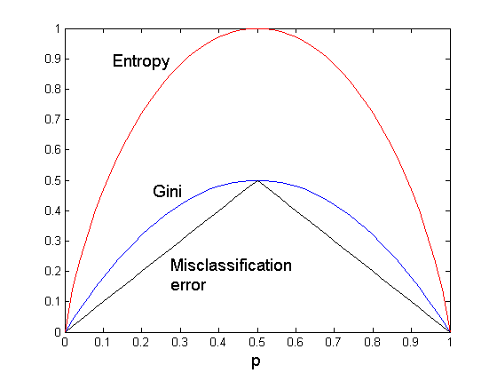
        * 与熵关联的是信息 information
          * 信息的定义与熵完全相反 熵需要最小化，信息则需要最大化
        * 所以当我们基于class拆分的时候，问题的关键在于这个class的属性中能给到多少information
          * 当时纯净分布时候，给我们最大的信息
          * 不想干的属性给我们很少信息
          * 所以在我们最大化信息的同时也在最小化熵
            * infomation gain(IG) = Entropy before the split - Entropy after the split
          * 在例子中我们需要基于Homeowner、Marital Status、Annual Income拆分，需要分别计算IG
            * 基于Homeowner拆分后的IG为: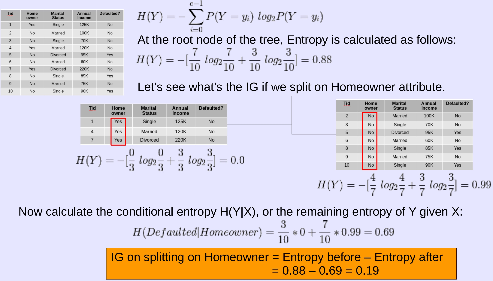
            * 基于Marital Status、Annual Income的拆分后IG为: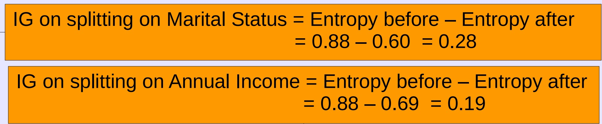
    * 何时结束拆分
  * 特征
    * 分类的非参数方法
    * 找到最优决策树NP
    * 构建最低成本树
    * 多重共线性(线性回归中的参数关联)不影响准确性
      * 正常情况下，如果发现属性间存在共线性，丢弃一个
    * 直线决策边界
      * 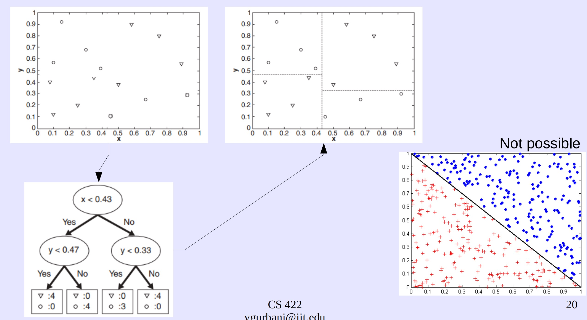
  * 模型选择
    * 模型=算法+假设
    * 当我们选择模型时，遵循以下步骤
      * 准备训练数据
      * 选择假设与算法
      * 调整算法
      * 训练模型，使用测试数据来验证结果
    * 假设有两种模型(回归和神经网络)，那个模型更适合你的数据集
      * 评估模型适用性有两个指标
        * 模型检查 Model checking
        * 性能评估 Performance estimation
      * 最终目标，选择适用于数据集最好的模型
      * 我们如何定义最好？(最好的模型叫做最终模型)
      * 最好的模型是给你最小的预测错误或最小损失在训练集和测试集中
    * 模型检查 给定一个数据集，我们将其分为训练集和测试集
      * 模型通过训练集训练，在测试集验证结果
      * 问题在于，如果随机出的测试集与模型并不具有代表性，相差过大
      * 解决方案:交叉验证  Cross validation
        * 交叉验证:一种系统地创建和评估多个模型的方法数据集的多个子集
        * 方法:
          * 留出法 Holdout method
            * 将数据集分为训练集、验证集、测试集
          * K折交叉验证 k-fold cross validation
            * 将数据集D划分成k个大小相似的互斥子集，每个子集Di都尽量保持数据分布的一致性，即从D中通过分层采样得到，然后每次用k - 1个子集的并集作为训练集，余下的那个自己作为测试集，这样可以获得k组训练/测试集，从而进行k次训练测试，最终结果为k次训练测试的均值
          * 留一交叉验证 Leave one out cross-validation (LOOC)
            * 留一交叉验证是一个极端的例子，如果数据集D的大小为N,那么用N-1条数据进行训练，用剩下的一条数据作为验证，用一条数据作为验证的坏处就是可能$E_{val}和E_{out}$相差很大，所以在留一交叉验证里，每次从D中取一组作为验证集，直到所有样本都作过验证集，共计算N次，最后对验证误差求平均，得到Eloocv(H,A)，这种方法称之为留一法交叉验证。
        * 在k-fold和LOOC数据验证中，将数据集拆分为3个部分更健壮
          * 训练集、验证集、测试集
        * 在这些留出方法中通过错误决定何时停止训练
          * 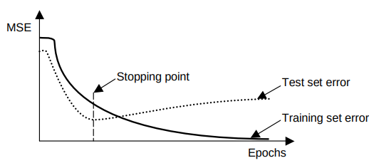
    * 性能评估 在数据集或非正式的目标函数上训练的特定分类器
      * 如何评估模型的性能
        * 混淆矩阵 Confusion matrix 广泛运用
          * 提供矩阵计算的大量指标
        * ROC曲线 Receiver Operating Characteristics (ROC) curve
          * 表征正面命中和误报之间的权衡
      * 关注模型准确性，而不是训练时间，以及分类速度
      * 例子: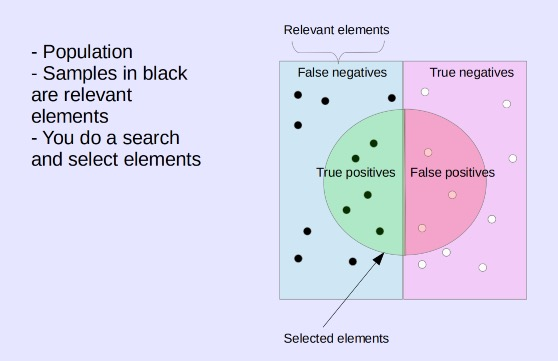
        * 对应的混淆矩阵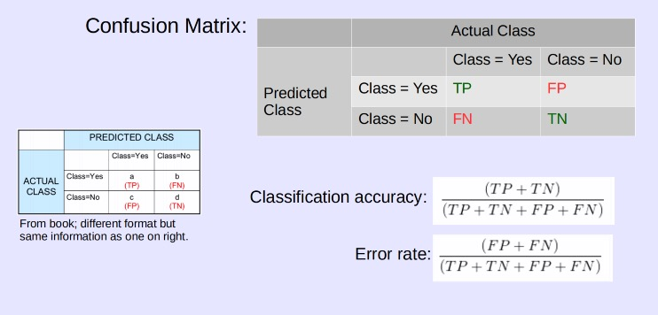
        * TPR true positive rate $TPR = TP/P = TP/(TP+FN)$
        * TNR true negative rate $TNR = TN/N = TN/(TN+FP)$
        * PPV positive predictive value $PPV = TP/(TP+FP)$
        * 例子:在确诊为COVID-19的人群中，抗原检测在平均72%的有症状人群中正确识别出COVID-19感染。在没有感染COVID-19的人群中，抗原检测正确排除了99.5%有症状的人的感染
          * TP为72% FP为0.5% FN为28% TN为99.5%
          * TPR为0.72
          * TNR为0.995
          * 在这种情况下，这是个好的测试吗？
            * 就医护角度来说，这并不是，因为医护关注的是降低FN的值，也就是有28%比率有症状的人没有被识别出
        * 独立的accuracy准确性并不是一个好的衡量标准
          * 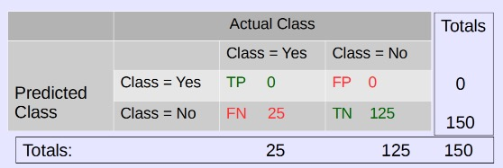
          * 在这里准确率很高，但是预测精确度为0