## Association Analysis (Rules)

* Topics:
  * Logistics and Recap
  * Association analysis

### 关联规则挖掘 Association Rule Mining
* 对于事务同时发生的关注
  * 购物篮分析
  * 网站浏览
* 并不是推荐相关产品，只是关注物品关联性
* 给定一组交易，找到将根据交易中其他项目的出现来预测项目发生的规则。（注意：暗示意味着共同发生，而不是因果关系！）
  * 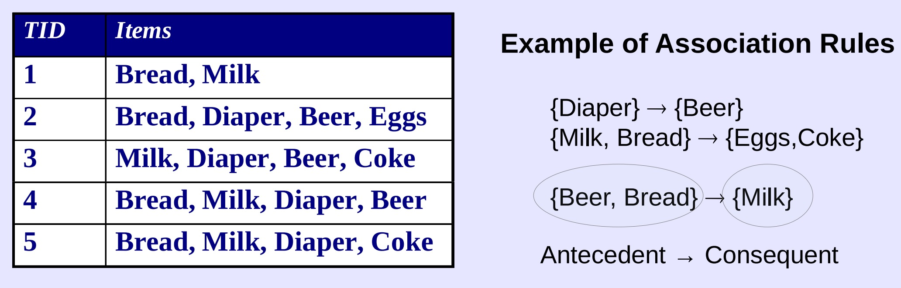
  * 前言 Preliminaries
    * 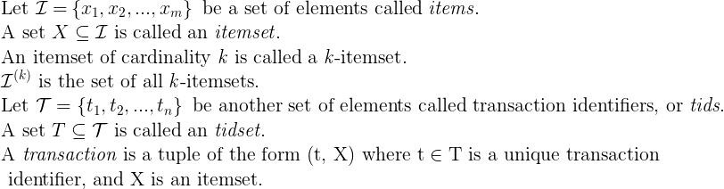
    * 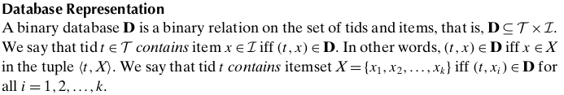
    * 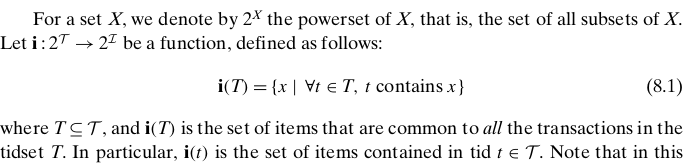
    * 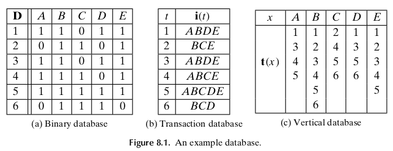
    * 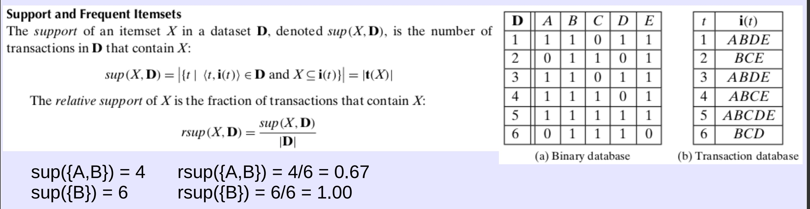
    * 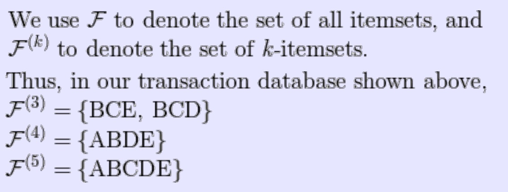
    * 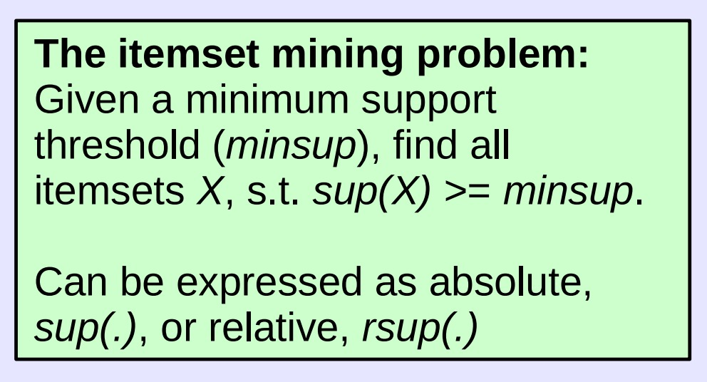
    * 频繁物品集:对于集合X，如果sup(X) ≥ minsup，这里的minsup是用户指定的最小支持阈值。（如果minsub是一个分数，也支持）
      * 例子，当minsup=3和minsup=0.5含义相同，代表所有例子中的数据集
      * 对于子数据集，如果有I个元素，最多有2的I次方个
      * 从图中可以算出有19个频繁数据集k-itemset
      * sup(3)={AD,CE,DE,ABD,ADE,BCE,BDE,ABDE}
      * sup(4)={A,C,D,AB,AE,BC,BD,ABE}
      * sup(5)={E,BE}
      * sup(6)={B}
      * 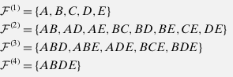
      * 我们如何生成所有频繁的项集
        * 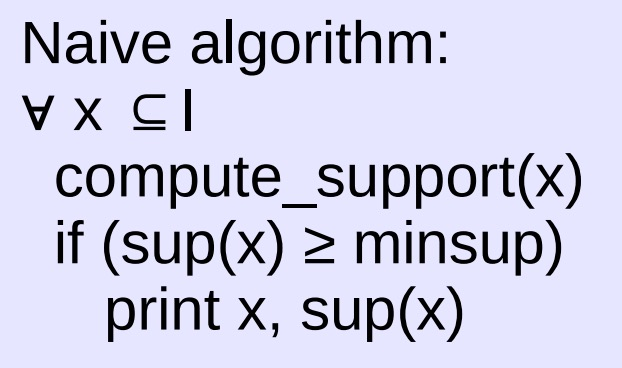
      * 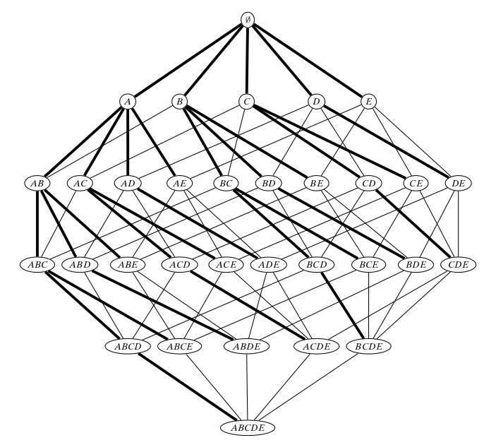
      * 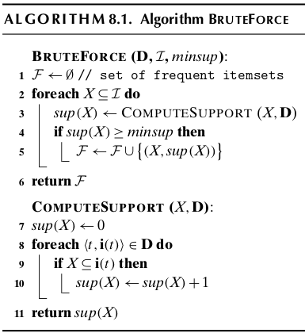