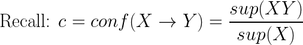

## Association Analysis (Rules)

* Topics:
  * Logistics and Recap
  * Association analysis

### 关联规则挖掘 Association Rule Mining
* 对于事务同时发生的关注
  * 购物篮分析
  * 网站浏览
* 并不是推荐相关产品，只是关注物品关联性
* 给定一组交易，找到将根据交易中其他项目的出现来预测项目发生的规则。（注意：暗示意味着共同发生，而不是因果关系！）
  * 
  * 前言 Preliminaries
    * 
    * 
    * 
    * 
    * 
    * 
    * 
    * 频繁物品集:对于集合X，如果sup(X) ≥ minsup，这里的minsup是用户指定的最小支持阈值。（如果minsub是一个分数，也支持）
      * 例子，当minsup=3和minsup=0.5含义相同，代表所有例子中的数据集
      * 对于子数据集，如果有I个元素，最多有2的I次方个
      * 从图中可以算出有19个频繁数据集k-itemset
      * sup(3)={AD,CE,DE,ABD,ADE,BCE,BDE,ABDE}
      * sup(4)={A,C,D,AB,AE,BC,BD,ABE}
      * sup(5)={E,BE}
      * sup(6)={B}
      * 
      * 我们如何生成所有频繁的项集
        * 
      * 
      * 
* 关联规则挖掘的目标：对于给定数据集T
  * support(sup)>=minsup
  * confidence>=minconf
* 两个步骤
  * 频繁项集生成：找到所有满足 minsupthreshold 的项（频繁项集）。（计算成本很高！！）
  * 规则生成：从频繁项集中提取所有高置信度规则（强规则）。
  * 频繁项集生成：先验方法 The Apriori Approach
    * 基于Brute-force方法去计算频繁数据集浪费计算力。
    * 如果X和Y均是I的子集，且X从属于Y，那么sup(X)>=sup(Y)
      * E.g. X=ABCD, Y=ABCDE, then sup(ABCD) >= sup(ABCDE).
    * Apriori方法原则
      * 如果一个子集属于频繁集，那么这个子集的子集也属于频繁集
      * 
      * 相同的是如果一个子集不属于频繁集，那么这个子集的所有父集也不属于频繁集
      * 
      * 
      * 
  * 规格生成
    * 
    * 使用置信度来修剪规则
      * 
    * 与sup不同的是，置信度不表现出单调性
    * 定理：如果规则X→ Y \ X不满足置信度，那么任何属于X的子集也不满足置信度规则
      * 
      * Example: Y={a,b,c,d}, X={b,c,d}; X → Y \ X => {b,c,d} → {a,b,c,d} \ {b,c,d} => {b,c,d} → {a} If {b,c,d} → {a} does not satisfy the confidence threshold, then any X’ X must not satisfy the confidence threshold as well.
      * 计算部分，需要自己算
      * null规则的计算，{null} → {ABDE} = sup(null&ABDE)/sup(null) = 3 / 6(database number)
        * 任何值 → {null} = {任何值}/{任何值} = 1
      * k个值一共有$2^k$个数据集，包含null数据集
      * 规则数量，针对d个数值 
    * minsup的值对于数据集的影响
      * 如果minsup值过高(0.2)，我们可能失去低关联但是价值度很高的数据，比如珠宝的关联性
      * 如果minsup值过低(0.001)，我们会得到太多关联数据
    * support与confidence值的讨论
      * 例子：
        * Evaluate {Tea} → {Coffee}.
        * sup({Tea,Coffee}) = 150; rsup({Tea,Coffee}) = 150/1000 = 0.15 (15%).
        * conf({Tea} → {Coffee}) = sup({Tea,Coffee})/sup({Tea}) = 150/200 = 0.75.
        * 喜欢咖啡的占比0.8
        * 喜欢茶和咖啡的占比0.75
        * rule {Tea} → {Coffee}的结果是具有误导性
      * 例子显示即使高conf也会带来数据误导性
        * 一个新的计算公式lift 
        * 我们关注lift的值大于1或者远小于1的情况